<div align="center">

<picture>
  <source media="(prefers-color-scheme: dark)"  srcset="banner-dark.svg">
  <source media="(prefers-color-scheme: light)" srcset="banner-light.svg">
  
</picture>

<br/>


<br/>

[](https://roodhelios.github.io/Portfolio.github.io/)
[](https://www.linkedin.com/in/aryan-singh-rootkid)
[](mailto:Aryanpratapsingh1912@gmail.com)


</div>

---

## `whoami`

```
Aryan Singh — Security Engineer
├── now      : M.S. Cybersecurity @ Northeastern University (Khoury)
├── before   : 15 months securing production AWS + a 40-server hybrid fleet
├── building : Zero Trust authorization for autonomous AI agents
├── into     : cloud IAM, detection engineering, malware reverse engineering
└── seeking  : Summer 2027 security engineering co-op
```

- Spent 15 months as a Security Engineer rebuilding IAM around least privilege across 6 AWS accounts, segmenting VPCs, and hardening Linux/Windows fleets.
- Now focused on a problem I think is underbuilt: **autonomous AI agents get permanent trust after one login.** That's a terrible security model, so I'm building the alternative.
- Comfortable on both sides of the line — I write policy engines and I also take apart packed PE32 loaders in FLARE-VM.

---

## Featured Work

<table>
<tr>
<td width="50%" valign="top">

### Aegis
**Zero Trust control plane for autonomous AI agents**

Every tool call an agent makes is authorized before it executes — identity verified, request signed, risk scored, policy evaluated.

`Python` `FastAPI` `OPA/Rego` `PostgreSQL` `Redis` `Ed25519`

_Private repository_

</td>
<td width="50%" valign="top">

### Digital Footprint Risk Visualizer
**Attack surface & vulnerability intelligence platform**

Four scanners orchestrated behind one authenticated control layer, each sandboxed, findings normalized into a single severity-ranked view.

`React` `Node.js` `MongoDB` `Docker` `JWT` `TOTP MFA`

[Repo →](https://github.com/roodhelios/Digital-Footprint-Analyzer)

</td>
</tr>
<tr>
<td width="50%" valign="top">

### Artemis / TSULoader Analysis
**Malware reverse engineering**

Static and dynamic teardown of a packed PE32 loader — high-entropy section analysis through to the dropped DLL payload.

`FLARE-VM` `IDA Pro` `capa` `Procmon` `FakeNet-NG`

_Writeup coming_

</td>
<td width="50%" valign="top">

### Network Threat Detection
**GRU-LSTM traffic anomaly model**

Hybrid recurrent model on temporal flow features, detecting DDoS and MITM-associated traffic at ~92% accuracy.

`TensorFlow` `Keras` `Pandas` `AWS Lambda`

_Repo coming_

</td>
</tr>
<tr>
<td colspan="2" valign="top">

### Zero Shadow — Autonomous Asset Intelligence
**Local-first asset correlation & explainable security risk engine**

Correlates explicitly scoped asset observations from multiple sources into stable asset identities while preserving source evidence. Built around deterministic matching, safe fixture-driven development, and explainable risk scoring rather than opaque discovery.

`Python` `Asset Correlation` `Risk Scoring` `Security Automation` `Deterministic Tests`

[Repo →](https://github.com/roodhelios/zero-shadow-autonomous-asset-intelligence)

</td>
</tr>
</table>

---

## Toolkit

<details open>
<summary><b>Security Engineering &amp; IAM</b></summary>
<br/>


</details>

<details>
<summary><b>Cloud &amp; Infrastructure</b></summary>
<br/>


</details>

<details>
<summary><b>Detection &amp; Network Security</b></summary>
<br/>


</details>

<details>
<summary><b>Offensive Security &amp; Malware RE</b></summary>
<br/>


</details>

<details>
<summary><b>Languages</b></summary>
<br/>


</details>

---

## Stats

<div align="center">


</div>

---

<div align="center">

**Never trust. Always verify.**

</div>
